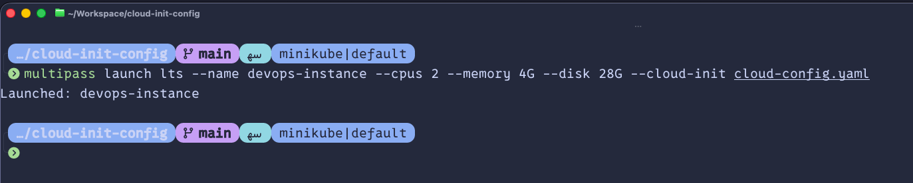
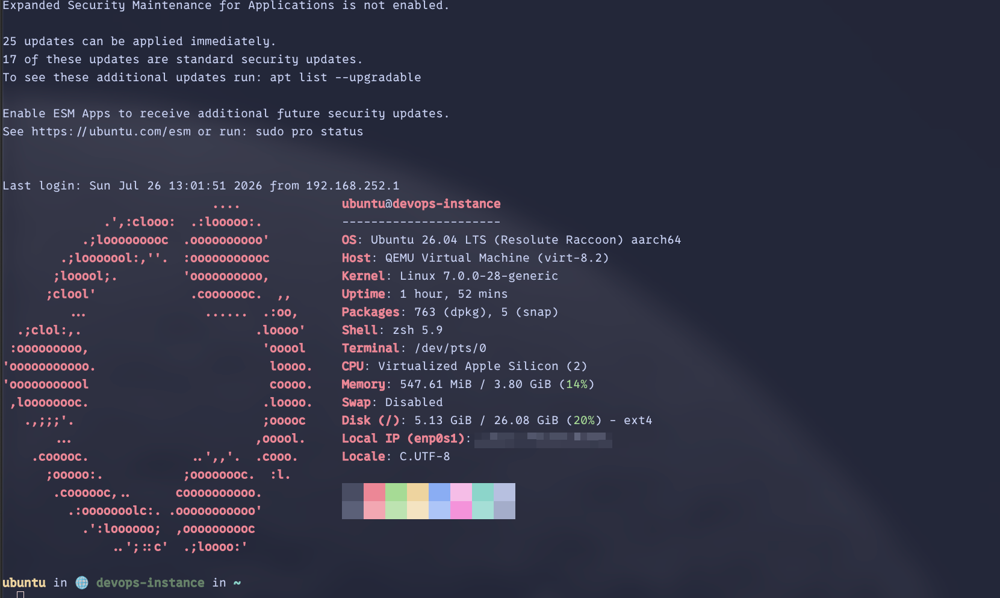
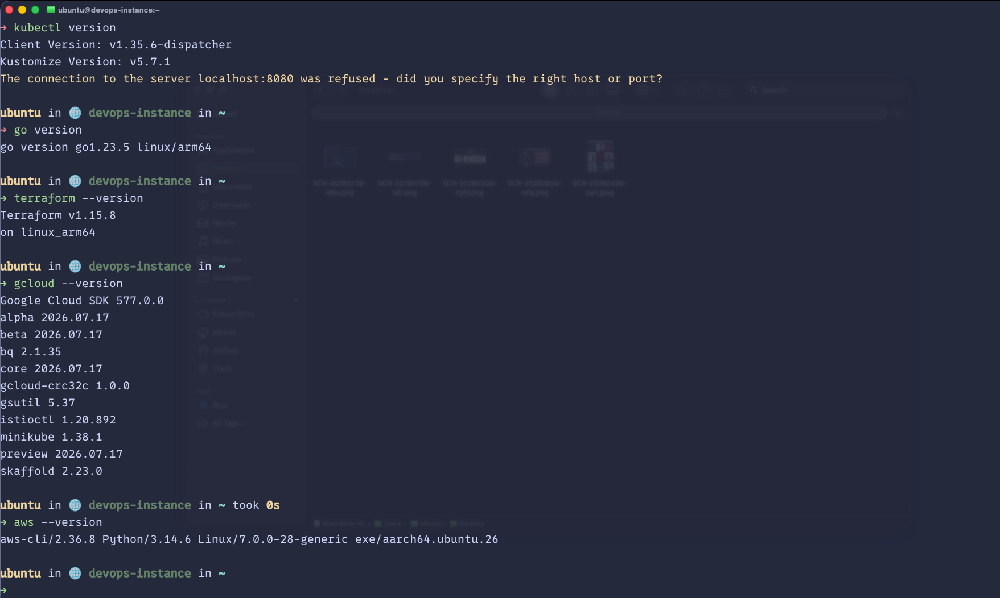

+++
draft = true
date = 2026-07-26T13:45:58-06:00
title = "Multipass + cloud-init"
description = "My reproducible Ubuntu DevOps VM in one command"
authors = []
tags = ["devops", "cloud", "multipass", "ubuntu", "terraform", "kubernetes", "local-development"]
categories = ["DevOps", "Cloud"]
author = "Alejandro Flores"
+++

# Multipass + cloud-init

**My reproducible Ubuntu DevOps VM in one command**

To avoid a local environment cluttered with manual installations and version conflicts in backend and DevOps, I use a lightweight and clean solution: an Ubuntu virtual machine (VM) in **Multipass**, configured from the first boot with **cloud-init**.

This allows me to spin up a declarative, reproducible, and disposable environment in minutes. If something fails, I delete the VM and recreate it without affecting my host machine.

> GitHub repository: [afr-dt/cloud-init-config](https://github.com/afr-dt/cloud-init-config)

---

## What problem am I solving?

Working with multiple tools (Terraform, Kubernetes, cloud CLIs, and runtimes) directly on the host machine leads to common issues:
- Conflicts between programming language versions (Python, Node.js, Go) and system packages.
- Difficulty updating AWS/GCP CLIs consistently.
- Lack of documentation on how tools were installed.
- Low reproducibility when changing computers or sharing setups.

The goal is to achieve an **isolated** environment that is **declaratively** defined (version controlled in Git) and easy to **destroy and recreate** in seconds.

---

## Why Multipass + cloud-init?

While containers are very useful, sometimes you need a complete development environment with a real operating system.

**Multipass** allows you to create lightweight Ubuntu VMs quickly and easily. **cloud-init** automates the initial installation and configuration using a declarative file (YAML), replacing long manual installation guides. In short: Multipass provides the machine, and cloud-init defines its state.

---

## Architecture of the approach

```text
macOS / Linux host -> Multipass -> Ubuntu VM -> cloud-init -> Tools and Runtimes
```

This workflow keeps the host machine clean and the workspace isolated.

---

## What this DevOps instance includes

The VM is automatically provisioned on its first boot with the following tools:
- **Languages and Runtimes**: Go, Python (managed with `uv`), Node.js (managed with `nvm`), and `build-essential`.
- **Cloud & Infrastructure**: Terraform, AWS CLI v2, and Google Cloud CLI (`gcloud`).
- **Kubernetes**: `kubectl`, `k9s`, `kubectx`, `kubens`, and `kubecolor`.
- **Environment & Utilities**: Zsh with Starship, Neovim with LazyVim, `jq`, `fzf`, `htop`, `tmux`, `curl`, and `git`.

---

## Launching and managing the instance

With Multipass installed, clone the repository and run:

```bash
# Launch the VM with the declarative configuration
multipass launch lts --name devops-instance --cpus 2 --memory 4G --disk 28G --cloud-init ./cloud-config.yaml
```


```bash
# Access the VM shell
multipass shell devops-instance
```


```bash
# Delete and purge the VM when finished
multipass delete --purge devops-instance
```

---

## First-boot experience

Upon entering the VM for the first time, the `ubuntu` user already has passwordless `sudo` privileges, Zsh/Starship configured as the shell, and Neovim ready to use.
This demonstrates the value of `cloud-init`: instead of executing manual setup scripts, the entire system state is defined declaratively, reproducibly, and shareably in a single YAML file.

---

## Verifying the provisioning

Once inside the VM, you can verify that the main tools are available by running:

```bash
terraform version && aws --version && gcloud version && kubectl version --client && go version && node -v && python --version
```


---

## Common use cases

This VM is ideal for:
- Developing and deploying Terraform configurations in isolation.
- Authenticating and running tasks in AWS and GCP without persisting credentials on the host.
- Experimenting with Kubernetes (`kubectl`, `k9s`) safely.
- Testing Go, Python, or Node.js runtimes without altering local machine versions.

---

## Trade-offs and limits

This approach does not replace all local use cases:
* For simple tasks or a single runtime, a Docker container is usually faster and lighter.
* If you require graphical interfaces (GUI) or direct integration with host hardware, working natively is better.

However, for DevOps and infrastructure tasks, the reproducibility and isolation of a real, code-based environment outweigh these limitations.

---

## Closing thoughts

Controlling your development environment as code is a major productivity boost. With Multipass and `cloud-init`, you can easily experiment without cluttering your host system.

The next step is to customize `cloud-config.yaml` to fit your own needs: mount directories, install Docker, or configure personal dotfiles.
